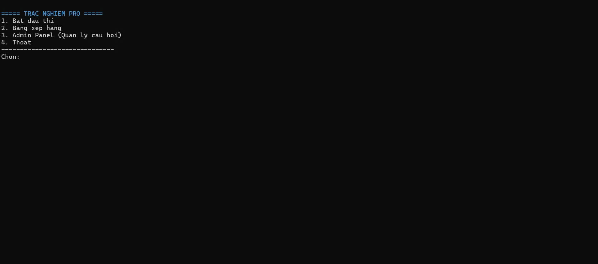
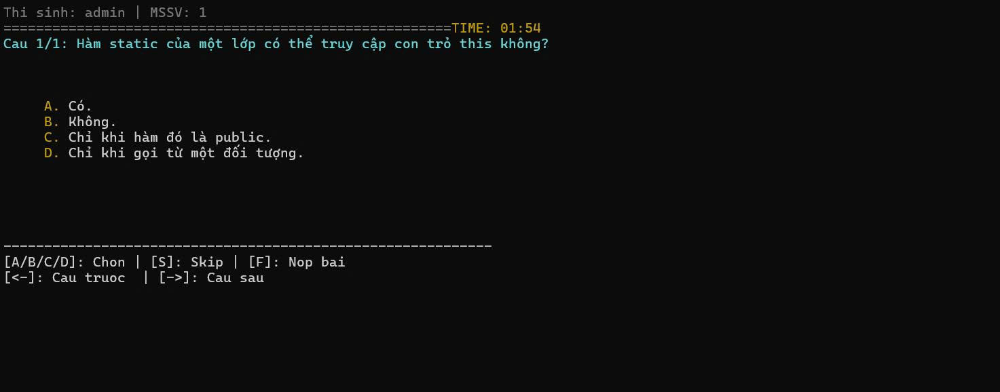
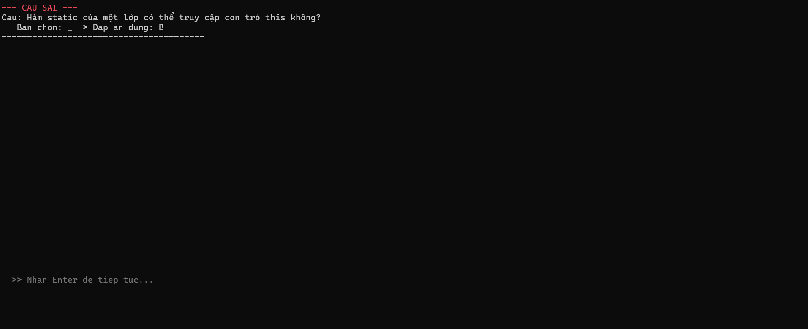
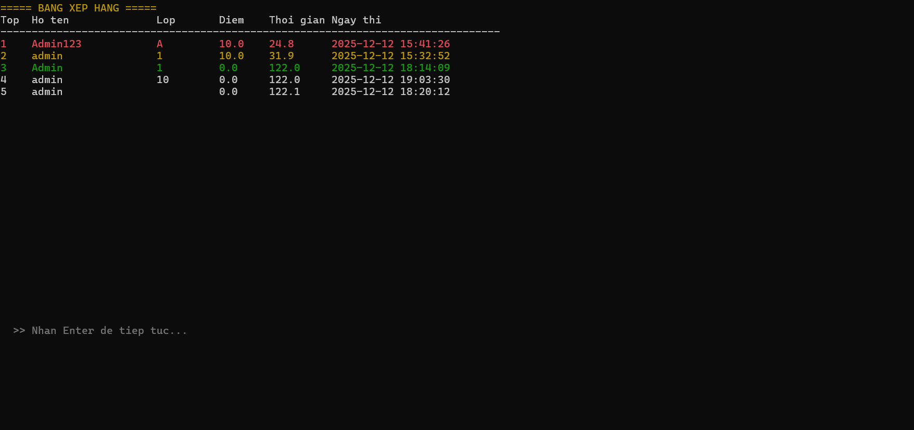
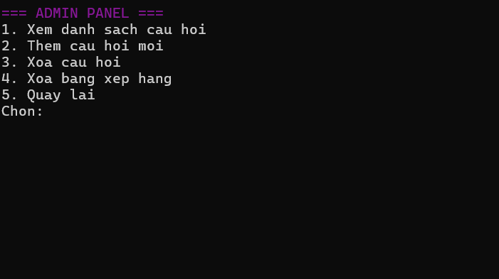

# 🎓 C++ Quiz Pro - Hệ Thống Thi Trắc Nghiệm & Tạo Đề Thông Minh


[Download to use]((https://github.com/Cuong512/CPP_Quiz_App/releases/download/v1.0/TracNghiemPro.zip))

**C++ Quiz Pro** là ứng dụng thi trắc nghiệm chạy trên nền tảng Console (CMD), được tối ưu hóa giao diện người dùng (UI/UX) với màu sắc, khung viền và điều hướng mượt mà. Dự án đi kèm với bộ công cụ Web giúp tạo đề thi tự động và hướng dẫn sử dụng AI để chuyển đổi dữ liệu.

---

## 🚀 Tính năng nổi bật

### 🎮 Dành cho Người dự thi
- Giao diện trực quan, hỗ trợ tiếng Việt UTF-8  
- Di chuyển câu hỏi bằng phím `⬅` `➡`  
- Phím `S` để bỏ qua, `F` để nộp bài  
- Đồng hồ đếm ngược + tự động thu bài  
- Lưu bảng xếp hạng (Leaderboard)

### 🛡️ Dành cho Admin
- Đăng nhập bảo mật (mật khẩu mặc định: `admin`)  
- Quản lý ngân hàng câu hỏi: Xem / thêm / xóa  
- Reset dữ liệu bài thi hoặc làm mới bộ đề  

---

## 📂 Cấu Trúc Dự Án

```text
MyQuizProject/
├── main.cpp                # Điểm khởi chạy chương trình
├── Quiz.cpp / .h           # Logic chính (Bài thi, Admin, Thời gian)
├── Question.h              # OOP - Lớp Câu hỏi
├── Utils.h                 # Hàm tiện ích (Màu sắc, hiệu ứng console)
├── questions.txt           # Ngân hàng câu hỏi
├── results.txt             # Kết quả và bảng xếp hạng
├── CMakeLists.txt          # Build CMake hỗ trợ mọi IDE
```

---

## 🛠️ Bộ Công Cụ Hỗ Trợ

### ✔️ 1. Trình tạo câu hỏi (Web Tool)
Công cụ chạy trực tiếp trên trình duyệt – soạn câu hỏi, nhập dữ liệu thô, xuất file chuẩn.
[Click here](https://cuong512.github.io/Question-Maker-Pro/)

---

### 🤖 2. Chuyển đổi dữ liệu bằng AI (PDF → Quiz)
Prompt mẫu:

```
Tôi có danh sách câu hỏi trắc nghiệm dưới đây. Hãy chuyển đổi nó sang định dạng chuẩn sau để tôi nhập vào phần mềm:

QUY TẮC ĐỊNH DẠNG:
1. Dòng 1: Nội dung câu hỏi.
2. Dòng 2-5: Bắt đầu bằng A. B. C. D. là nội dung các đáp án.
3. Dòng 6: Chỉ ghi duy nhất ký tự đáp án đúng (A, B, C hoặc D).
4. Dòng 7: Dấu gạch ngang 3 cái: ---
5. Lặp lại cho đến hết.

DỮ LIỆU CỦA TÔI:
[Dán nội dung câu hỏi của bạn vào đây]
```

---

## ⚙️ Hướng Dẫn Cài Đặt & Chạy

### 🟦 Cách 1: Visual Studio
1. Create a new project → Empty Project  
2. Kéo file `.cpp`, `.h`, `questions.txt` vào  
3. F5 để chạy  

Fix lỗi tiếng Việt: Save with Encoding → UTF-8 with Signature (BOM)

---

### 🟧 Cách 2: VS Code / CLion (CMake)
- Mở thư mục dự án  
- Cài extension `C/C++` + `CMake Tools`  
- Chọn kit GCC hoặc MSVC  
- Nhấn Build → Run  

---

## 📸 Ảnh Minh Họa






---

## 🤝 Đóng Góp (Dự án có thể sai sót 1 vài chỗ bạn có thể cùng mình phát triển ứng dụng này thêm nhé 😎)

```bash
git checkout -b feature/AmazingFeature
git commit -m "Add AmazingFeature"
git push origin feature/AmazingFeature
```

---

## 📝 Tác giả
Mike512 – Developer

